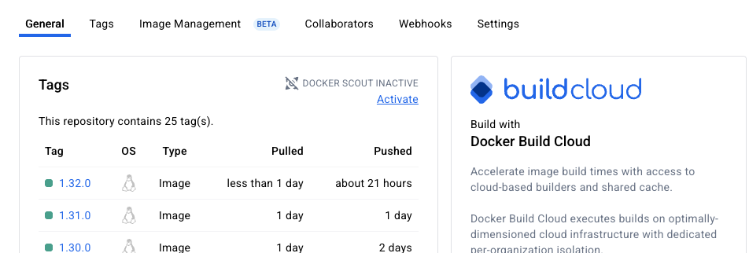

# Capstone Project – Spring PetClinic Application

This project is based on the official [Spring PetClinic Sample Application](https://github.com/spring-projects/spring-petclinic).

The CI/CD process is implemented using GitHub Actions (GHA) pipelines. There are two supported cases:

---

## Option A – Main Branch Deployment

* Push changes to the `main` branch.
* The `push-main-build` pipeline runs automatically, creating a new Docker image.
* Once the image is built, you can deploy it by approving the `manual_deploy` job.
* After deployment, the application becomes accessible via the external IP address of the GCP load balancer.

  

---

## Option B – Feature Branch / Pull Request Workflow

* Create a new branch and open a Pull Request (PR).
* After the PR is approved, the pipeline builds a new JAR artifact.
* The artifact is then uploaded to the Artifact Registry in GCP.

  

